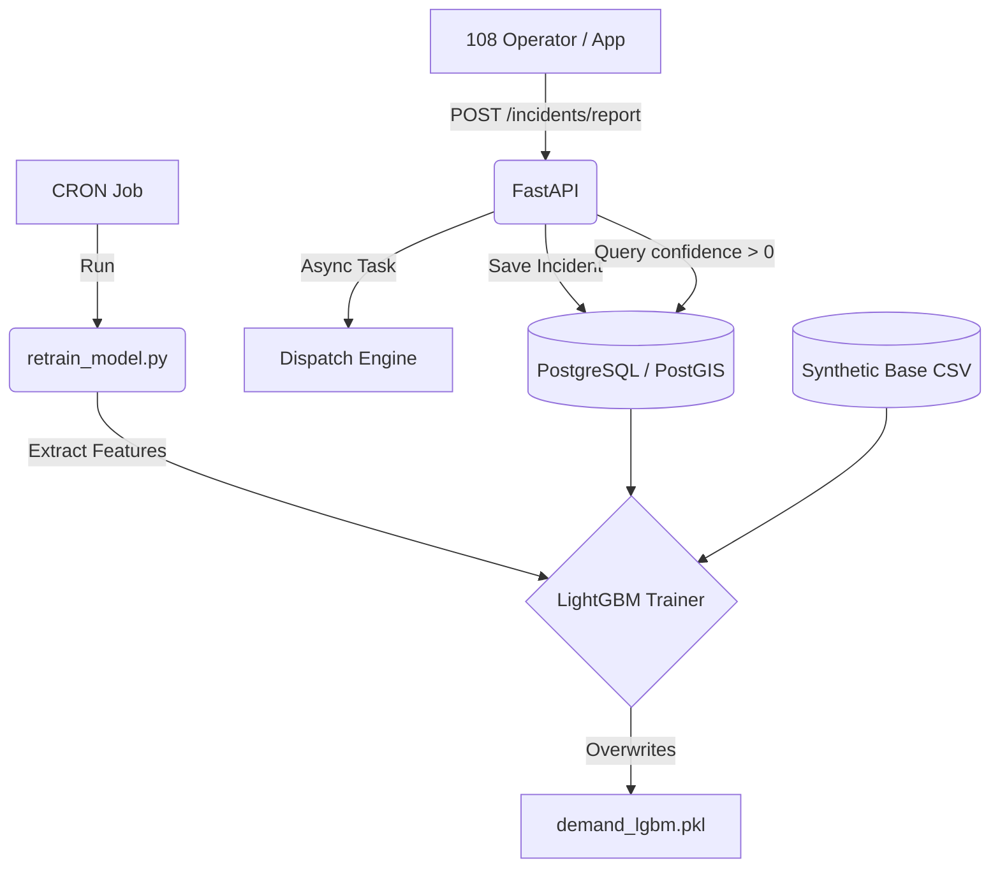
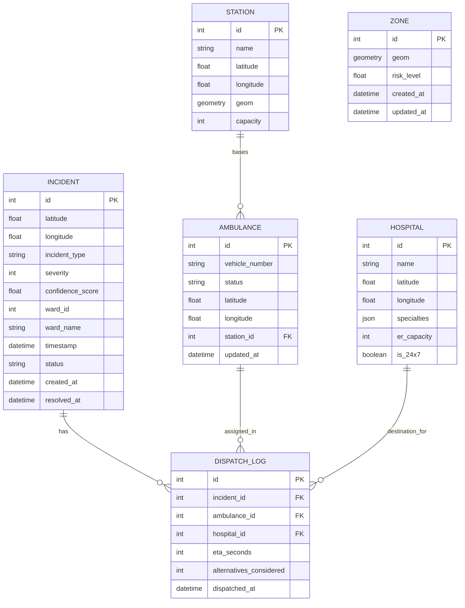
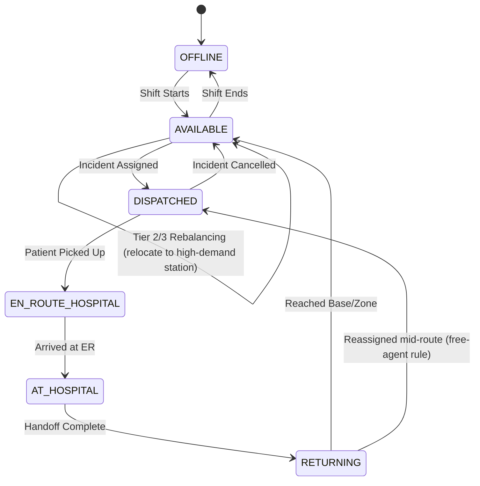
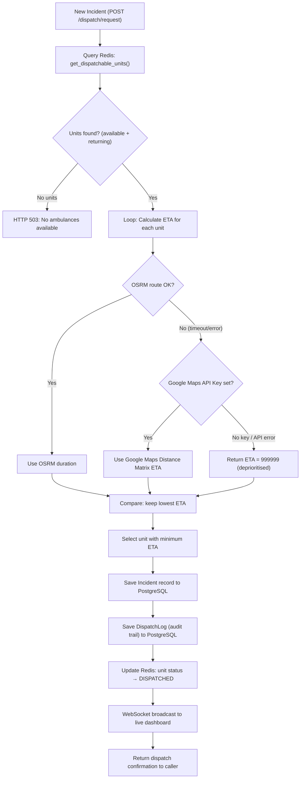

# ResQ — Backend Core
> AI-Native Dispatch Optimisation Engine for Urban Emergency Medical Services

[](https://python.org)
[](https://fastapi.tiangolo.com)
[](https://postgis.net)
[](LICENSE)
[]()

---

## Overview

ResQ is an ETA-minimisation dispatch engine for urban ambulance fleets. It replaces proximity-based dispatch — the industry default — with a system that evaluates every available unit across the entire fleet on predicted arrival time under live traffic conditions, rebalances fleet distribution continuously, and routes patients to the optimal hospital on every dispatch.

The backend is the intelligence layer. It exposes a FastAPI surface consumed by the mobile frontend and dispatcher dashboard.

---

## Core Problem

| Dimension | Proximity Dispatch | ResQ |
|---|---|---|
| Dispatch logic | Nearest unit by distance | Fastest unit by real-time ETA |
| Fleet distribution | Static, drifts through shift | Dynamic three-tier rebalancing |
| Demand anticipation | Reactive only | Probabilistic spatial pre-positioning |
| Zone geometry | Circular — overlaps and blind spots | Irregular polygon mesh |
| Hospital routing | Nearest facility | Ranked by ER capacity, specialty, and ETA |

Academic literature on optimised dispatch reports response time reductions of up to 42% over nearest-unit approaches in simulation (Zarkeshzadeh et al., 2015). ResQ targets improvements at the upper end of this range for the Indian urban context.

---

## Architecture

Five independently deployable and testable engines, unified behind a FastAPI layer.

```
                    ┌─────────────────────────────────┐
                    │         ResQ Backend Core        │
                    └─────────────┬───────────────────┘
                                  │
          ┌───────────────────────┼───────────────────────┐
          │                       │                       │
    ┌─────▼──────┐         ┌──────▼─────┐         ┌──────▼─────┐
    │  Spatial   │         │  Dispatch  │         │  Hospital  │
    │  Engine    │         │  Engine    │         │  Router    │
    └─────┬──────┘         └──────┬─────┘         └──────┬─────┘
          │                       │                       │
    ┌─────▼──────┐         ┌──────▼─────┐                │
    │  Demand    │         │Rebalancing │                │
    │  Surface   │         │  Engine    │                │
    └────────────┘         └────────────┘                │
          │                       │                       │
          └───────────────────────┴───────────────────────┘
                                  │
                    ┌─────────────▼───────────────┐
                    │        FastAPI Layer         │
                    │    (consumed by frontend)    │
                    └─────────────────────────────┘
```

## System Pipeline



## Database Schema



## State Machines & Workflows

### Ambulance State Machine


### Dispatch Logic Flow


---

## Engines

### Spatial Engine

Models the city as a dynamic probabilistic risk landscape rather than a static map. Operates in three stages:

**Stage 1 — Risk Surface Generation**

Builds a continuous probability surface using a non-parametric spatial density model. No fixed distribution is assumed — the surface shape is entirely data-driven from:
- Historical incident records with location and timestamp
- Population density per micro-zone
- Road network topology and traffic volume corridors
- High-density points of interest: tech parks, malls, hospitals, stadiums
- Temporal patterns: time of day, day of week, seasonal variation

**Stage 2 — Surface Evolution Prediction**

A sequential ML model predicts how the risk surface shifts over the next N minutes based on live traffic conditions, time-of-day patterns, ongoing incidents in the system, and historical shift patterns at equivalent timestamps.

**Stage 3 — Adaptive Mesh Generation**

Both surfaces — current and predicted — feed into a constrained mesh generation model that drapes an irregular polygon mesh over the risk landscape:
- High-risk zones produce small, dense polygons for maximum response density
- Low-risk zones produce large, sparse polygons for efficient resource distribution
- Mesh is stitched to physical geography: rivers, flyovers, one-ways, administrative boundaries
- Dispatch station vertices are fixed infrastructure; zone boundaries are software-defined and recalculated periodically

---

### Dispatch Engine

Every ambulance in the fleet is a live node: GPS coordinate, status flag, and real-time ETA computation.

On every incident:
1. All available units across the entire fleet are evaluated — zone lines do not exist during active dispatch
2. ETA is computed under live traffic conditions via OSRM, with Google Maps / HERE as the primary real-time feed
3. The unit with minimum ETA is dispatched
4. The full decision is written to the audit log: unit selected, ETA computed, all alternatives evaluated, timestamp

**Free-agent rule:** A dispatched unit can be reassigned mid-field if it holds the lowest ETA to a new incident, without returning to base first. If no qualifying incident arises before handoff completes, the unit does not return home — it flows directly into the rebalancing process and routes to the highest-demand station.

**No-withholding policy:** Units are never held back to protect zone coverage minimums. Coverage gaps trigger automatic mutual aid from the least-stressed neighbouring zone, in parallel with dispatch — never instead of it.

**Audit guarantee:** Every dispatch decision is fully logged with all alternatives considered. No decision is undocumented.

---

### Rebalancing Engine

Fleet distribution drifts through a shift as units are dispatched. Three concurrent tiers correct this continuously without blocking active dispatch decisions.

| Tier | Trigger | Action |
|---|---|---|
| **Tier 1 — Urgent** | Zone reaches zero units | Immediate pull from nearest surplus station. Coverage over efficiency. |
| **Tier 2 — Scheduled** | Every N hours | Optimisation pass against predicted demand. Units move only if ERT gain exceeds relocation cost. |
| **Tier 3 — Passive** | Post-handoff unit return | Unit routes to highest-demand station rather than home base. Zero added overhead. |

While a unit is en route to hospital, the backend pre-computes its optimal post-handoff destination. When handoff completes, the next assignment is already set — zero decision latency at the moment the unit becomes available.

---

### Hospital Router

Nearest hospital and best hospital are not the same. On every dispatch, candidate hospitals are ranked by:
1. Real-time traffic ETA
2. Specialty match with incident type: trauma, cardiac, burns, neuro, general
3. Current ER capacity and operational status
4. 24/7 availability

Top recommendation plus two to three alternatives are surfaced to the ambulance crew via the Crew App. Crew retains final authority and can override at any time. All overrides are logged and feed back into hospital weighting over time. Repeated overrides for a specific hospital trigger a data quality review.

---

## Objective Function

All rebalancing and pre-positioning decisions are evaluated against a single function — Expected Response Time (ERT):

```
ERT = Σ P(i) × T(i)
```

- `P(i)` — predicted probability of an incident in zone i, derived from the demand surface
- `T(i)` — travel time from the nearest available unit to zone i under current traffic

Every engine decision that reduces ERT is correct. Every decision that increases it is not.

---

## Data Inputs

| Signal | Source | Refresh |
|---|---|---|
| Historical incidents | Bangalore Traffic Police / RTI / public records | Periodic |
| Road network | OpenStreetMap via OSMnx | Periodic |
| Offline routing | OSRM on cached Bengaluru road graph | Every 15 minutes |
| Population density | Census of India | Annual |
| Live traffic | Google Maps Platform / HERE Maps API | Real-time |
| Hospital capacity | Manual entry + API where available | Near real-time |
| Weather | OpenWeatherMap API | Real-time |
| Points of interest | OpenStreetMap / Google Places | Periodic |

OSRM serves as the offline routing fallback when live traffic APIs are unavailable. Dispatch decisions are never blocked by upstream API failure.

---

## Deployment Target: Bengaluru

Bengaluru is the primary deployment target — not because it is easy but because it is one of the hardest urban road networks in India to optimise ETA dispatch on. The ORR corridor, Silk Board junction, Hebbal flyover, and inner-city density represent a genuine stress test. If ResQ works in Bengaluru, it works anywhere.

Future expansion: Hyderabad, Chennai, Mumbai, Delhi-NCR.

---

## Directory Structure

```text
resq-backend/
│
├── app/
│   ├── main.py                   # FastAPI entry point
│   ├── config.py                 # Environment and configuration
│   │
│   ├── api/                      # Route definitions
│   │   ├── dispatch.py           # Dispatch & override endpoints
│   │   ├── fleet.py              # Fleet state endpoints
│   │   ├── hospital.py           # Hospital routing endpoints
│   │   ├── incidents.py          # Incident reporting endpoints
│   │   ├── mesh.py               # Dispatch center & mesh overlay API
│   │   └── zones.py              # Zone generation & spatial risk API
│   │
│   ├── core/                     # Core business logic
│   │   ├── dispatch_engine.py    # ETA computation and unit selection
│   │   ├── fleet_state.py        # Live fleet state management (Redis)
│   │   ├── hospital_router.py    # Emergency hospital ranking logic
│   │   ├── logger.py             # Structured logging utility
│   │   ├── rebalancing.py        # Three-tier rebalancing logic
│   │   └── routing.py            # OSRM & Google Maps routing client
│   │
│   ├── db/                       # Database layer
│   │   ├── models.py             # ORM models (PostgreSQL)
│   │   ├── session.py            # DB session management
│   │   └── migrations/           # Alembic migrations
│   │
│   ├── ml/                       # ML models for demand forecasting
│   │   └── demand_model.py       # LightGBM demand predictor
│   │
│   └── spatial/                  # Spatial engine mapping
│       ├── mesh_generator.py     # Weighted Voronoi tessellation
│       └── risk_surface.py       # Gaussian KDE risk surface calculation
│
├── scripts/                      # Utility and setup scripts
│   ├── generate_synthetic_incidents.py
│   ├── load_bengaluru_osm.py     # Download OSM road graph
│   ├── reseed_all.py             # Full DB wipe, risk-weighted seeding & mesh gen
│   ├── retrain_model.py          # Cron script for LightGBM retraining
│   ├── seed_stations.py          # Setup initial fleet and bases (legacy)
│   └── test_*.py                 # Helper scripts for API E2E validation
│
├── tests/                        # Comprehensive test suite (Pytest)
│   ├── conftest.py               # Fixtures, Mock DB, Mock Redis
│   ├── test_api_*.py             # FastAPI endpoint integration tests
│   ├── test_dispatch.py          # Dispatch Engine unit tests
│   ├── test_fleet.py             # Fleet State & Redis unit tests
│   ├── test_hospital.py          # Hospital Router unit tests
│   ├── test_ml_demand.py         # ML Model unit tests
│   ├── test_rebalancing.py       # Rebalancing Engine unit tests
│   ├── test_routing.py           # Routing client unit tests
│   └── test_spatial.py           # KDE and Mesh unit tests
│
├── requirements.txt              # Python dependencies
├── .gitignore                    # Ignored files configuration
└── README.md                     # Project documentation
```

---

## Getting Started

### Prerequisites

- Python 3.11+
- PostgreSQL with PostGIS extension — spatial queries for polygon mesh storage and zone boundary lookups
- Redis — fleet state management and real-time caching
- OSRM — offline routing engine, requires Bengaluru road graph (see `scripts/load_bengaluru_osm.py`)

### Installation

```bash
git clone https://github.com/jhaksh-24/ResQ_backend.git
cd ResQ_backend
python -m venv venv
source venv/bin/activate        # Linux/macOS
# .\venv\Scripts\activate       # Windows
pip install -r requirements.txt
cp .env.example .env
# configure environment variables (see table below)
uvicorn app.main:app --reload
```

### Environment Variables

| Variable | Description | Required |
|---|---|---|
| `DATABASE_URL` | PostgreSQL connection string with PostGIS | Yes |
| `REDIS_URL` | Redis connection string for fleet state | Yes |
| `OSRM_BASE_URL` | OSRM server URL (default: `http://localhost:5000`) | Yes |
| `GOOGLE_MAPS_API_KEY` | Google Maps Distance Matrix API key (routing fallback) | No (fallback disabled if absent) |
| `APP_ENV` | Environment: `development` / `production` | No |
| `DEBUG` | Enable debug logging | No |

### Running Synthetic Data Generation & Seeding

1. **Generate synthetic data:**
```bash
python scripts/generate_synthetic_incidents.py
```

2. **Seed the database & Redis cache:**
```bash
python scripts/reseed_all.py
```

The `reseed_all.py` script performs a complete spatial setup:
- Clears existing data in PostgreSQL and Redis.
- Seeds hospitals.
- Dynamically generates dispatch centers proportional to risk weights (e.g., more centers in the ORR corridor).
- Seeds thousands of ambulances and syncs their live state to Redis.
- Computes the KDE risk surface and generates the adaptive Voronoi zone mesh.

### Running Tests

```bash
# Run all tests
pytest tests/ -v

# Run with coverage report
pytest tests/ --cov=app --cov-report=term-missing

# Run a specific test file
pytest tests/test_dispatch.py -v
```

**Current status:** 44 tests passing, 81% code coverage across `app/`.

---

## API Endpoints

| Method | Endpoint | Description |
|---|---|---|
| `POST` | `/dispatch/request` | Submit a new incident and trigger automatic dispatch |
| `GET` | `/dispatch/history` | Fetch recent dispatch audit logs |
| `POST` | `/incidents/report` | Report an incident (from 108 operator / app) |
| `POST` | `/fleet/{unit_id}/location`| Push GPS coordinates for an ambulance |
| `POST` | `/fleet/{unit_id}/status`  | Change ambulance status (available, offline, etc.) |
| `GET` | `/fleet/status` | Get real-time fleet state from Redis |
| `GET` | `/hospital/list` | Get all registered hospitals |
| `GET` | `/hospital/recommend` | Find ranked hospitals by ETA, specialty, and capacity |
| `GET` | `/api/dispatch-centers`| Operator UI map: Dispatch centers with live fleet counts |
| `GET` | `/api/mesh` | Operator UI map: Computes KNN mesh links between centers |
| `GET` | `/zones/mesh` | Get the current dispatch Voronoi zone mesh (GeoJSON) |
| `POST` | `/zones/generate` | Trigger full risk surface and mesh regeneration |
| `GET` | `/zones/stations` | List all dispatch centers used as Voronoi seeds |
| `GET` | `/zones/risk-surface` | Query the KDE risk surface at a grid resolution |

---

## Research Foundation

- Zarkeshzadeh et al. (2015) — ETA-optimised dispatch demonstrates up to 42% response time reduction over nearest-unit methods in simulation
- Nakada et al. (2024) — Fleet rebalancing interventions produce statistically significant response time reductions in urban EMS systems

---

## Accountability

ResQ is a logistics and routing coordination layer. All medical decisions are made exclusively by licensed professionals — ambulance crew in the field and hospital staff on arrival. ResQ is accountable for its algorithm and its technology. Clinical outcomes are outside its domain.

Every dispatch decision is logged with timestamp, unit selected, ETA computed, all alternatives considered, and outcome. The system never makes an undocumented decision.

---

## Team

| Name | USN | Role |
|---|---|---|
| Akshat Kumar Jha | 1WA24CS031 | Backend Core, Spatial Engine, ML Pipeline, System Architecture |
| Aditya Dadheech | 1WA24CS018 | Backend, ML Pipeline, Data Pipeline, Incident Data Sourcing |
| Arush Mandhan | 1WA24CS054 | Frontend Core, API Integration, Interaction & Response Engineering |
| Aryan Surya K.S | 1WA24CS060 | Frontend, API Integration, Interaction & Response Engineering, Logo Design |

*B.M.S. College of Engineering, Dept. of Computer Science & Engineering, Bengaluru*
*Mobile Application Development — Semester 4, 2026*

---

## Roadmap

- [x] Bengaluru OSM road network loading
- [x] Historical incident data pipeline
- [x] Stage 1: Risk surface generation
- [x] Stage 2: Surface evolution prediction
- [x] Stage 3: Adaptive mesh generation
- [x] ETA dispatch engine
- [x] Three-tier rebalancing engine
- [x] Hospital routing engine
- [x] FastAPI layer
- [x] Simulation validation over Bengaluru incident data
- [ ] Live deployment trial
- [ ] Reinforcement learning based rebalancing calibration
- [ ] BBMP traffic signal integration

---

*ResQ is in active development. Contributions, feedback, and questions welcome.*